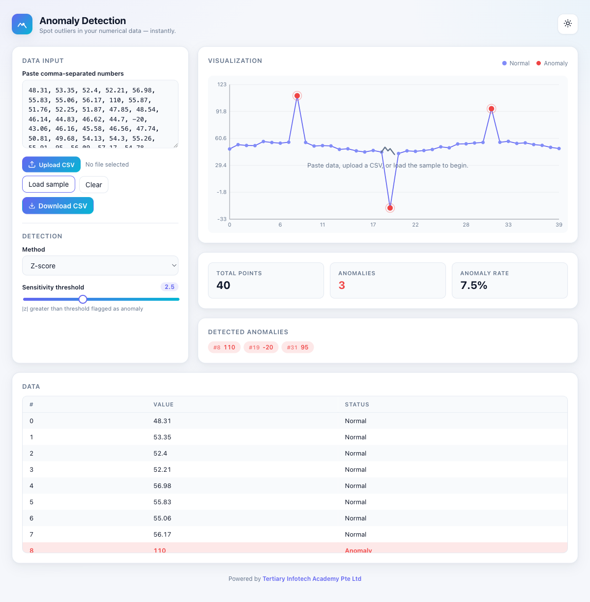

# Anomaly Detection Dashboard

A modern, responsive single-page web app for detecting outliers in numerical
datasets — built with **pure HTML, CSS, and vanilla JavaScript**. No frameworks,
no chart libraries.

> Live demo: enable **GitHub Pages** on this repo (Settings → Pages → Source:
> *GitHub Actions*). The included workflow publishes the site automatically on
> every push to `main`.



## Features

- **Dual data input** — paste comma-separated numbers, or upload a `.csv` file.
- **Two detection methods**
  - **Z-score** — flags points whose `|z|` exceeds the threshold.
  - **IQR** — flags points beyond `Q1 − k·IQR` or `Q3 + k·IQR`.
- **Live sensitivity slider** — anomalies recompute and re-render in real time.
- **Custom Canvas chart** — DPR-aware crisp rendering, gridlines, axis ticks,
  highlighted anomaly points, and hover tooltips. No chart library used.
- **Results panel** — total points, anomaly count, anomaly rate, sorted list of
  anomaly indices and values, plus a scrollable data table.
- **Export to CSV** — one-click download of `index, value, status` for every
  point, with a header line recording the method and threshold used.
- **Dark / light mode** — token-based theming, persisted in `localStorage`.
- **Friendly validation** — inline error banner for unparseable input.
- **Responsive layout** — CSS Grid that collapses to a single column on small
  screens.

## Tech Stack

- HTML5 (semantic markup)
- CSS3 (custom properties, Grid, Flexbox, smooth transitions)
- Vanilla JavaScript (ES6+, IIFE module pattern)
- Canvas API for visualization

No build step. No dependencies.

## Project Structure

```
.
├── index.html      # Layout shell (header, controls, chart, table)
├── styles.css      # Design tokens, theming, responsive grid
├── script.js       # Parsing, statistics, detection, chart, interactivity
└── .github/
    └── workflows/
        └── pages.yml   # Auto-deploy to GitHub Pages
```

## Getting Started

### Run locally

The app is fully static — open `index.html` directly in a browser, or serve
the folder with any local server, for example:

```bash
# Node
npx http-server -p 8000 -c-1

# Python 3
python -m http.server 8000
```

Then visit `http://localhost:8000/`.

### Try it out

1. Click **Load sample** to populate ~40 synthetic points with three injected
   outliers.
2. Drag the **Sensitivity threshold** slider — anomalies recompute live.
3. Switch between **Z-score** and **IQR** in the method dropdown.
4. Hover the chart points to see exact values.
5. Toggle the sun/moon icon in the header for dark mode.

## Detection Methods

### Z-score
For each value `x`, compute `z = (x − μ) / σ` (using sample standard
deviation). Flag when `|z| > threshold`. Slider range: `1.0`–`5.0`.

### IQR (Interquartile Range)
Compute `Q1` and `Q3` via linear interpolation on the sorted data, then
`IQR = Q3 − Q1`. Flag any value outside
`[Q1 − k·IQR, Q3 + k·IQR]`. Slider range: `0.5`–`3.0` (Tukey's classic value
is `1.5`).

## Deployment

The `.github/workflows/pages.yml` workflow uploads the repository root as a
GitHub Pages artifact and deploys it on every push to `main`.

To enable:
1. Push the repo to GitHub.
2. Go to **Settings → Pages**.
3. Under **Build and deployment → Source**, choose **GitHub Actions**.
4. Re-run (or push to) `main`; the site will publish at
   `https://<user>.github.io/<repo>/`.

## License

MIT
